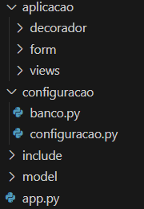
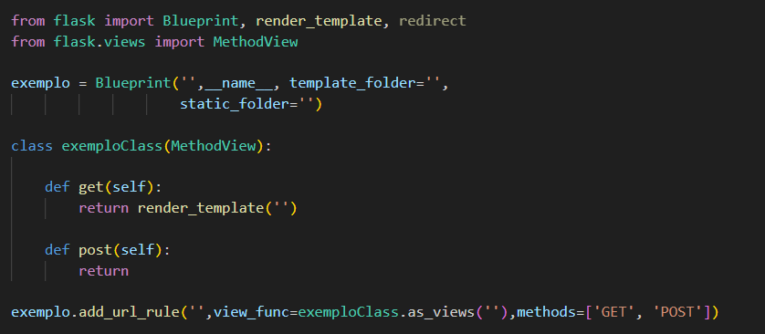
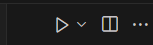

## Estrutura de Backend em Flask
    - Construir essa estrutura em Flask para ter uma base já criada, onde eu utilizo ela muito nos 
    meus projetos, criar ela sempre faz perder muito tempo, principalmente configurando ela. 
    Sou Kauã, um estudante de Ciências da Computação.

# Principios da Estrutura
    A estrutura tem 4 pastas principais, model, include, aplicacao e configuração, onde cada uma tem 
    uma função de separa e deixar organizados as pequenas parte do projeto
   

    # Pasta Aplicação tem com o proposito, conter os decoradores, os formularios e views do projetos, 
    cada um é uma pasta onde agrupa arquivos da mesma   função nele.
       
        • Pasta do decorador tem o propósito de guardar arquivos que tem como objetivo ser o decorador
         da projeto, como decorador de Login, de Adm e etc... Eu fiz uma pequena demostração de como 
         pode ser feito.

        • Pasta do form, ela tem proposito de agrupar todos os arquivos de formularios do projeto, 
        onde ele são chamado pela views para passar para o Front... Eu fiz uma pequena demostração de
         como pode ser feito

        • Pasta do views, a pasta mais importante da aplicação, ela é onde é feito a logica do projeto, o 
        proposito dela é agrupar todos os arquivos que são de views em só um lugar... Eu fiz uma 
        pequena demostração de como pode ser feito
        
    # Pasta Configuração tem o objetivo configurar o projeto e organizar toda a configuração em um só 
    lugar
       
        • banco.py - Arquivo onde configura o banco de dados, com SQLAlchemy

        • configuracao.py 
           
            - Configura o banco de dados, passando os dados de database
            
            - Cofigura:
                Chave Secreta ,
                TEMPLATE_FOLDER , 
                STATIC_FOLDER , 
                Login_user
    
    # Pasta Include tem como proposito guardar os arquivos que podem ser incluídos em outros arquivos 
    de um projeto
      
        • Pasta Templates é onde fica os arquivos templates, como html

        • Pasta Static é onde fica os arquivos estaticos, como CSS e JavaScript
    
    # Pasta Model é onde fica todos os modelos do banco de dados do projeto
        
        • Eu fiz uma pequena demostração de como pode ser feito
    
    # app.py é onde a aplicação é iniciada, onde todos os arquivos são chamados e inciados

# Como usar a estrutura
     
     Se quiser usar essa estrutura, basta fazer um git clone
        
        • segue o comando
           
           git clone "https://github.com/KauaHenrique-neclon/estrutura-flask"

     Criar as tabelas, usem o comando 
        
        • flask db init
        • flask db migrate -m "Mensagem da migração"
        • flask db upgrade
     
     Views
        
        Na Pasta Views, basta criar mais pastas para facilitar a manutenção, use blueprint para 
        organizar e estruturar sua aplicação de forma escalavel e modeluzar, além de ser uma 
        boa pratica
        
        Boa praticas em views 

            • Blueprint
            • Classe-based-views

# Classe-Based-Views
   - Um padrão de Views

     
    
# Como rodar o servidor 
       
  - Só apertar run python file
  - Ele ira cria um servidor proprio para desenvolvimento

# Finalizando
 - Estrutura criada para padronizar os meus projetos, onde gosto de trabalhar. Se você tiver dicas,
  pode me comunicar; gostarei de implementar melhorias.